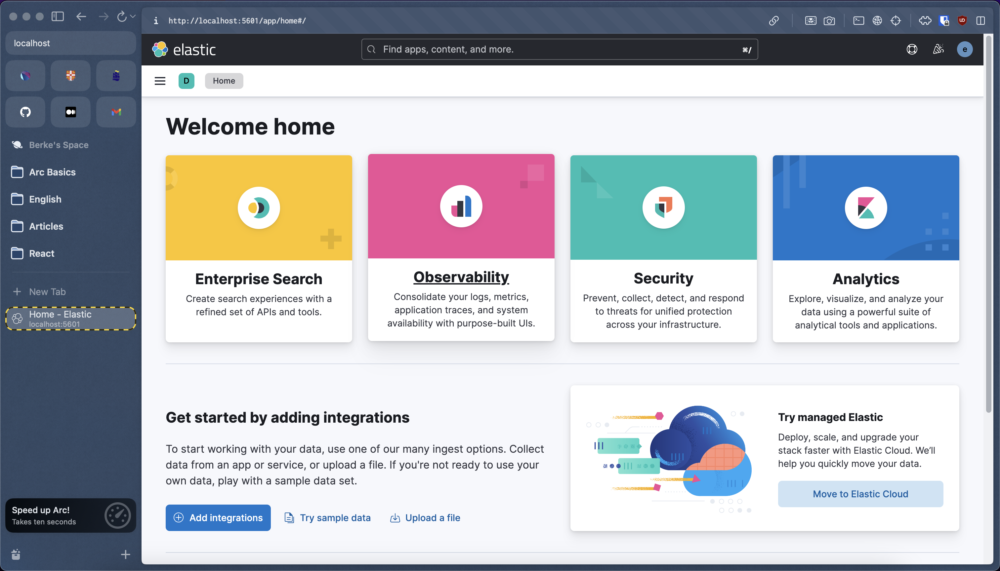
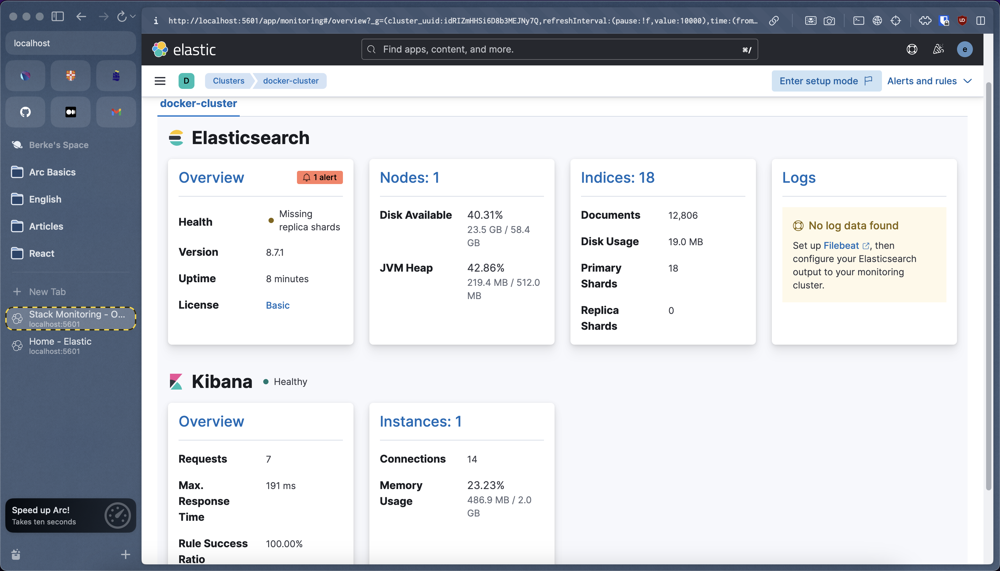

# Running Elastic Stack Tools Using Docker Compose

## Contents

- [Elastic Stack](#elastic-stack)
- [Compose Configuration And Usage](#compose)
- [Services](#services)
- [Details](#details)

## Elastic Stack <a name="elastic-stack"></a>

The Elastic tools used for this application:

- Elasticsearch
- Kibana
- Logstash
- Metricbeat
- Filebeat

`Elasticsearch` and `Kibana` starts from the `docker-compose.yml` file, while `Filebeat`, `Metricbeat`, and `Logstash` needs additional configuration from separate `yml` files.

### File Structure

```sh
├── .env
├── docker-compose.ymml
├── filebeat.yml
├── logstash.conf
└── metricbeat.yml
```

## Compose Configuration And Usage <a name="compose"></a>

As of 8.0, security is enabled by default. `setup-c` container is used here to make sure the certificate CA setup is established correctly. Having `security enabled` is a recommended practice and should not be disabled.

Build and run the application:

```sh
docker compose up --build
```

## Services <a name="services"></a>

- setup
- es01
- kibana
- metricbeat
- filebeat
- logtstash

### Setup Service (setup)

The `setup-c` container exits on purpose after it completes generating the certs and passwords.

### Elasticsearch Service (es01)

Copy the `ca.crt` out of the `es01-c` container:

```sh
docker cp es01-c:/usr/share/elasticsearch/config/certs/ca/ca.crt /tmp/.
```

Output: `Successfully copied 3.07kB to /tmp/.`

Once the certificate is downloaded, run a curl command to query the `Elasticsearch node`:

```sh
curl --cacert /tmp/ca.crt -u elastic:Bucket-Sevenfold8-Residue https://localhost:9200
```

Output:

```json
{
  "name": "es01",
  "cluster_name": "docker-cluster",
  "cluster_uuid": "idRIZmHHSi6D8b3MEJNy7Q",
  "version": {
    "number": "8.7.1",
    "build_flavor": "default",
    "build_type": "docker",
    "build_hash": "f229ed3f893a515d590d0f39b05f68913e2d9b53",
    "build_date": "2023-04-27T04:33:42.127815583Z",
    "build_snapshot": false,
    "lucene_version": "9.5.0",
    "minimum_wire_compatibility_version": "7.17.0",
    "minimum_index_compatibility_version": "7.0.0"
  },
  "tagline": "You Know, for Search"
}
```

So, `Elasticsearch` is accessed using `localhost:9200`. The password `Bucket-Sevenfold8-Residue` comes from the value defined at `.env` file and used at `docker-compose.yml` file.

### Kibana Service (kibana)

In `environment` section for `kibana` service, `ELASTICSEARCH_HOSTS=https://es01:9200` is specified.

Navigate to `http://localhost:5601` for `kibana`.

- Username: elastic
- Password: Bucket-Sevenfold8-Residue (for my definition)


http://localhost:5601/app/home#



### Metricebeat Service (metricbeat01)

`Metricbeat` is dependent on `ES01` and `Kibana` nodes being healthy before starting. We have enabled four modules for gathering metrics including Elasticsearch, Kibana, Logstash, and Docker. This means, once we verify Metricbeat is up, we can hop into Kibana and navigate to “Stack Monitoring” to see how things look.

http://localhost:5601/app/monitoring



### Filebeat Service (filebeat01)

http://localhost:5601/app/logs/stream


### Logstash Service (logstash01)

Logstash service...

## Details <a name="details"></a>

Here are the details for the images, containers, networks, and volumes used for the application.

### Images

```sh
docker images
```

```sh
REPOSITORY                                      TAG        IMAGE ID         CREATED          SIZE
docker.elastic.co/kibana/kibana                 8.7.1      b6fb473d4163     12 months ago    826MB
docker.elastic.co/elasticsearch/elasticsearch   8.7.1      1c46ca52228b     12 months ago    744MB
docker.elastic.co/beats/metricbeat              8.7.1      8efe3a73b9fc     12 months ago    297MB
docker.elastic.co/beats/filebeat                8.7.1      ff45b2969cfe     12 months ago    268MB
docker.elastic.co/logstash/logstash             8.7.1      09b51d8266ff     12 months ago    715MB
```

### Network

```sh
docker network ls
```

```sh
NETWORK ID     NAME        DRIVER    SCOPE
c94f41a7ddba   elastic     bridge    local
```

### Volumes

```sh
docker volume ls
```

```sh
DRIVER    VOLUME NAME
local     elastic-stack-compose_certs
local     elastic-stack-compose_esdata01
local     elastic-stack-compose_filebeatdata01
local     elastic-stack-compose_kibanadata
local     elastic-stack-compose_logstashdata01
local     elastic-stack-compose_metricbeatdata01
```

### Containers

- setup-c
- es-c
- kibana-c
- metricbeat-c
- filebeat-c
- logstash-c

```sh
docker ps
```

```sh
CONTAINER ID   IMAGE                                                 COMMAND                  CREATED          STATUS                   PORTS                              NAMES
cee89428d2db   docker.elastic.co/logstash/logstash:8.7.1             "/usr/local/bin/dock…"   7 minutes ago    Up 6 minutes             5044/tcp, 9600/tcp                 logstash01-c
b98eff0a0c25   docker.elastic.co/beats/filebeat:8.7.1                "/usr/bin/tini -- /u…"   16 minutes ago   Up 6 minutes                                                filebeat01-c
08d2ed88c696   docker.elastic.co/beats/metricbeat:8.7.1              "/usr/bin/tini -- /u…"   34 minutes ago   Up 6 minutes                                                metricbeat01-c
f30146ca4013   docker.elastic.co/kibana/kibana:8.7.1                 "/bin/tini -- /usr/l…"   53 minutes ago   Up 6 minutes (healthy)   0.0.0.0:5601->5601/tcp             kibana-c
207c59318a7e   docker.elastic.co/elasticsearch/elasticsearch:8.7.1   "/bin/tini -- /usr/l…"   2 hours ago      Up 7 minutes (healthy)   0.0.0.0:9200->9200/tcp, 9300/tcp   es01-c
```

Additionally, the `setup-c` container starts and stops.

```sh
CONTAINER ID   IMAGE                                                 COMMAND                  CREATED          STATUS                     PORTS         NAMES
19b1dff38e9f   docker.elastic.co/elasticsearch/elasticsearch:8.7.1   "/bin/tini -- /usr/l…"   2 hours ago      Exited (0) 7 minutes ago                 setup-c
```

References:
https://www.docker.elastic.co/
https://www.elastic.co/blog/getting-started-with-the-elastic-stack-and-docker-compose
